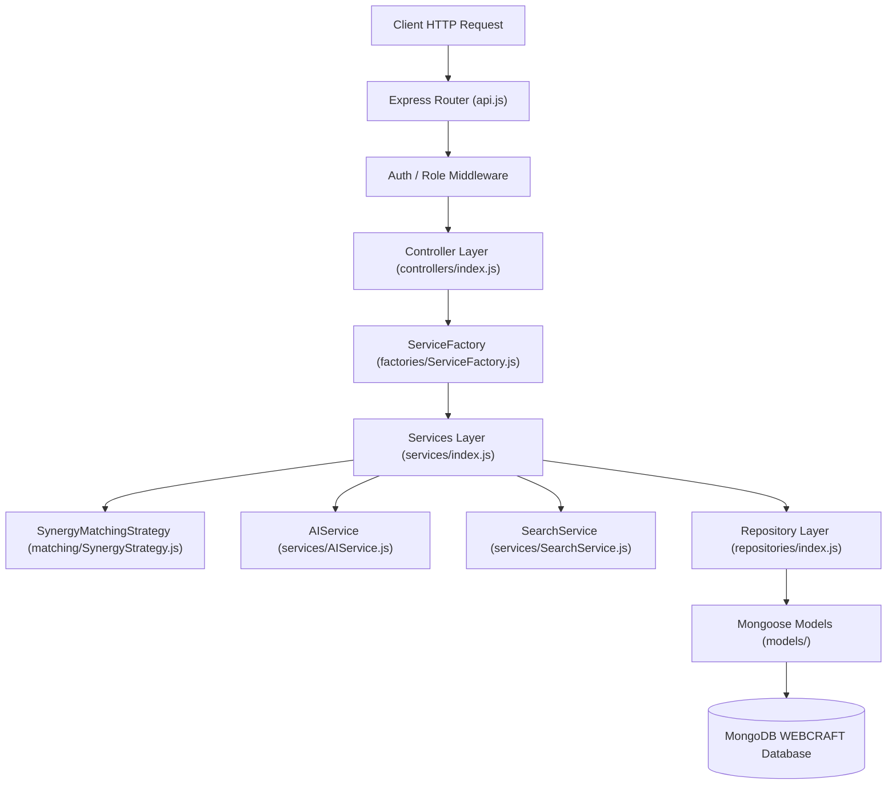

# SkillNexus — Backend Full-Stack Cross-Validation Audit Report

## 1. Executive Summary
This report audits the **SkillNexus** Node.js / Express backend server (`server/`). It validates the separation of concerns across Controllers, Service Layer, Repository Pattern, Service Factory, Strategy Pattern for matching, REST API endpoints in [`api.js`](file:///c:/Users/shyam/Documents/WEBCRAFT/server/routes/api.js), and centralized error handling middleware.

---

## 2. Backend Design Pattern Architecture



---

## 3. Design Pattern Audit

### A. Factory Pattern (`ServiceFactory.js`)
- **Location**: [`server/factories/ServiceFactory.js`](file:///c:/Users/shyam/Documents/WEBCRAFT/server/factories/ServiceFactory.js)
- **Validation**: Instantiates dependencies cleanly without scattering `new Repository()` across controllers:
  ```javascript
  export class ServiceFactory {
    static createUserService() { return new UserService(new UserRepository()); }
    static createExchangeService() { return new ExchangeService(new ExchangeRepository(), new UserRepository()); }
    static createAIService() { return new AIService(); }
    static createSearchService() { return new SearchService(new UserRepository(), new SkillRepository()); }
  }
  ```

### B. Strategy Pattern (`SynergyMatchingStrategy.js`)
- **Location**: [`server/services/matching/SynergyStrategy.js`](file:///c:/Users/shyam/Documents/WEBCRAFT/server/services/matching/SynergyStrategy.js)
- **Validation**: Encapsulates 2-way reciprocal skill synergy calculation logic into an interchangeable strategy class reading points dynamically from `process.env` (`MATCH_SYNERGY_*_POINTS`).

### C. Repository Pattern (`repositories/index.js`)
- **Location**: [`server/repositories/index.js`](file:///c:/Users/shyam/Documents/WEBCRAFT/server/repositories/index.js)
- **Validation**: Abstracts Mongoose queries (`User.findOne`, `Exchange.findOneAndUpdate`) from business services.

---

## 4. Endpoints & REST API Audit

| Endpoint | Method | Auth | Controller Method | Validation | Status |
| :--- | :--- | :--- | :--- | :--- | :--- |
| `/api/v1/health` | `GET` | Public | Inline | Returns system timestamp & DB status | **PASSED** |
| `/api/v1/auth/register` | `POST` | Public | `AuthController.register` | Validates email uniqueness & bcrypt hash | **PASSED** |
| `/api/v1/auth/login` | `POST` | Public | `AuthController.login` | Verifies password & generates JWT | **PASSED** |
| `/api/v1/users` | `GET` | Bearer | `UserController.getAll` | Filters passwords before return | **PASSED** |
| `/api/v1/users/:id/synergy`| `GET` | Bearer | `UserController.getSynergy` | Calculates 2-way match synergy | **PASSED** |
| `/api/v1/search` | `GET` | Public | `SearchController.search` | Mongo `$regex` + English/Tamil aliases | **PASSED** |
| `/api/v1/ai/chat` | `POST` | Public | `AIController.chat` | Invokes LLM / local engine fallback | **PASSED** |
| `/api/v1/exchanges` | `GET` | Bearer | `ExchangeController.getExchanges`| Queries requester or recipient ID | **PASSED** |
| `/api/v1/exchanges` | `POST` | Bearer | `ExchangeController.createProposal`| Prevents self & duplicate active proposals| **PASSED** |
| `/api/v1/exchanges/:id/status`| `PATCH`| Bearer | `ExchangeController.updateStatus`| Enforces state transitions & authorization| **PASSED** |
