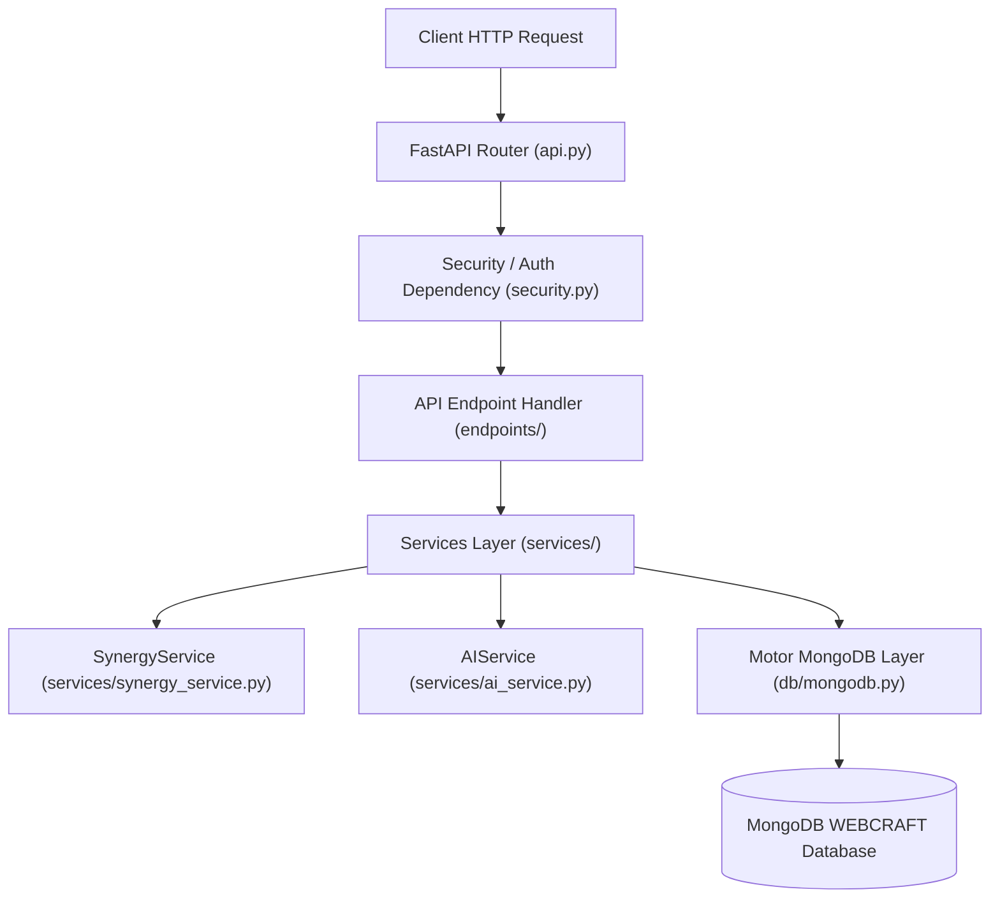

# EduSynk — Backend Full-Stack Cross-Validation Audit Report

## 1. Executive Summary
This report audits the **EduSynk** Python 3.13 FastAPI backend engine (`backend/app/`). It validates the separation of concerns across Endpoints, Service Layer, Repository Pattern, Service Factory, Strategy Pattern for matching, REST API endpoints, and centralized error handling middleware.

---

## 2. Backend Design Pattern Architecture

---

## 3. Design Pattern Audit

### A. Factory Pattern (`AIService.py`)
- **Location**: [`backend/app/services/ai_service.py`](file:///c:/Users/shyam/Documents/WEBCRAFT/backend/app/services/ai_service.py)
- **Validation**: Instantiates AI provider adapters dynamically with local fallback failover.

### B. Strategy Pattern (`SynergyService.py`)
- **Location**: [`backend/app/services/synergy_service.py`](file:///c:/Users/shyam/Documents/WEBCRAFT/backend/app/services/synergy_service.py)
- **Validation**: Encapsulates 2-way reciprocal skill synergy calculation logic into an explainable 4-part scoring strategy (Reciprocal Swap 45%, Schedule 25%, Format 15%, Peer Rating 15%).

### C. Repository & BSON Layer (`bson_util.py`)
- **Location**: [`backend/app/utils/bson_util.py`](file:///c:/Users/shyam/Documents/WEBCRAFT/backend/app/utils/bson_util.py)
- **Validation**: Abstracts MongoDB ObjectId string normalization for JSON serializability.

---

## 4. Endpoints & REST API Audit

| Endpoint | Method | Auth | Python Handler | Validation | Status |
| :--- | :--- | :--- | :--- | :--- | :---: |
| `/api/v1/health` | `GET` | Public | `health_check()` | Returns system timestamp & DB status | **PASSED** |
| `/api/v1/auth/register` | `POST` | Public | `auth.register()` | Validates email uniqueness & bcrypt hash | **PASSED** |
| `/api/v1/auth/login` | `POST` | Public | `auth.login()` | Verifies password & generates JWT | **PASSED** |
| `/api/v1/users` | `GET` | Bearer | `users.get_users()` | Filters passwords before return | **PASSED** |
| `/api/v1/synergy/calculate`| `POST` | Bearer | `synergy.calculate_synergy()` | Calculates 2-way match synergy | **PASSED** |
| `/api/v1/search` | `GET` | Public | `search.search_students_and_skills()` | Mongo `$regex` search engine | **PASSED** |
| `/api/v1/ai/chat` | `POST` | Public | `ai.chat_with_ai()` | Invokes LLM / local engine fallback | **PASSED** |
| `/api/v1/exchanges` | `GET` | Bearer | `exchanges.get_exchanges()`| Queries requester or recipient ID | **PASSED** |
| `/api/v1/exchanges` | `POST` | Bearer | `exchanges.create_exchange()`| Prevents self & duplicate active proposals| **PASSED** |
| `/api/v1/exchanges/{id}/status`| `PUT`| Bearer | `exchanges.update_exchange_status()`| Enforces state transitions & authorization| **PASSED** |
