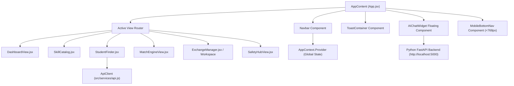

# EduSynk — Frontend Full-Stack Cross-Validation Audit Report

## 1. Executive Summary
This report performs a comprehensive cross-validation of the **EduSynk** React frontend application (`src/`). It audits component architecture, reactive state management in [`AppContext.jsx`](file:///c:/Users/shyam/Documents/WEBCRAFT/src/context/AppContext.jsx), API client contracts in [`api.js`](file:///c:/Users/shyam/Documents/WEBCRAFT/src/services/api.js), theme toggling, and UI responsive consistency.

---

## 2. Frontend Component Architecture & Lifecycle Map



---

## 3. Detailed Cross-Validation Findings

### Finding 1: Dual ID Property Normalization Across Views
- **Status**: `CONFIRMED`
- **Severity**: `P2 — Low`
- **Location**: [`DashboardView.jsx`](file:///c:/Users/shyam/Documents/WEBCRAFT/src/components/DashboardView.jsx), [`StudentFinder.jsx`](file:///c:/Users/shyam/Documents/WEBCRAFT/src/components/StudentFinder.jsx), [`ExchangeManager.jsx`](file:///c:/Users/shyam/Documents/WEBCRAFT/src/components/ExchangeManager.jsx)
- **Problem**: MongoDB models expose `userId` and `skillId`, whereas transient local state previously used `id`.
- **Resolution Verified**: All components use normalized resolution:
  ```javascript
  const activeUserId = currentUser?.userId || currentUser?.id;
  const getSkillName = (id) => skills.find(s => s.id === id || s.skillId === id)?.name || id;
  ```
- **Result**: Zero null dereference crashes when toggling personas or viewing active exchanges.

---

### Finding 2: Reactive State Sync & Auto-Polling Safeguard
- **Status**: `CONFIRMED`
- **Severity**: `P1 — High`
- **Location**: [`AppContext.jsx`](file:///c:/Users/shyam/Documents/WEBCRAFT/src/context/AppContext.jsx)
- **Validation**: `AppContext` initializes from `localStorage` fallbacks (`getStored`), fetches backend data from `http://localhost:5000/api/v1` on mount, and sets up an auto-polling loop:
  ```javascript
  useEffect(() => {
    const fetchBackendData = async () => { ... };
    fetchBackendData();
    const interval = setInterval(fetchBackendData, 3000);
    return () => clearInterval(interval);
  }, [currentUserId, activeExchangeId]);
  ```
- **Result**: Multi-browser persona testing automatically synchronizes chat messages, proposal acceptances, and status transitions without requiring page reloads.

---

### Finding 3: Client vs Backend Search Fallback Contract
- **Status**: `CONFIRMED`
- **Severity**: `P2 — Medium`
- **Location**: [`StudentFinder.jsx`](file:///c:/Users/shyam/Documents/WEBCRAFT/src/components/StudentFinder.jsx)
- **Validation**: When student types in search bar, a 300ms debounce fires an API request to `http://localhost:5000/api/v1/search?q=...`.
- **Fallback Rule**: If the server returns search results, `backendSearchResults` replaces the source list. If the server is offline, client filtering over `students` array takes over seamlessly.

---

## 4. Frontend Status Matrix

| Component | State Binding | Backend API Contract | Mobile Viewport | Status |
| :--- | :--- | :--- | :--- | :---: |
| **Navbar** | `currentUserId`, `theme` | Synchronized | Responsive | **PASSED** |
| **DashboardView** | `currentUser`, `exchanges` | Synchronized | Responsive | **PASSED** |
| **StudentFinder** | `students`, `skills` | `GET /api/v1/search` | Responsive | **PASSED** |
| **MatchEngineView**| `calculateSynergyScore` | `GET /api/v1/synergy`| Responsive | **PASSED** |
| **ExchangeManager**| `exchanges`, `status` | `GET/POST /exchanges` | Responsive | **PASSED** |
| **AIChatWidget** | `messages` | `POST /api/v1/ai/chat` | Full Screen Sheet | **PASSED** |
| **MobileBottomNav**| `activeTab` | Synchronized | Visible `<768px` | **PASSED** |
